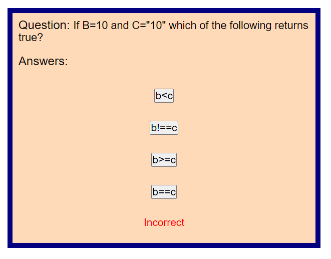

# JavaScript Quiz

## Description

In this project a website was created with an interactive coding quiz to test Javascript knowledge. Coding assessments are a typical part of the interview process as a full-stack web developer. Usually they are combination of multiple-choice questions and interactive coding challenges.  

The quiz was developed using dynamically updated HTML and CSS powered by Javascript code with following criteria:

- When the start button is clicked to begin the quiz a timer starts
- When a question is answered another question is presented
- When a question is answered incorrectly time is subtracted from the clock
- When all the questions are answered or timer reaches 0 the game is over
- When the game is over you can save your initials and score

## Installation

N/A

## Usage

On the website click on the Start Game button to begin the quiz. Answer the question that is presented and the result of the answer will be displayed. Then the next question will be displayed until the time is over or all questions are completed. When the game is over, the users score is displayed and an input box for initials. Saving the initials will log them in local storage and reroute the page to the home screen. The High Scores page can be accessed by clicking the link on the navigation bar.  

 
 

## Credits

N/A

## [Website Link](https://l-lavelle.github.io/Code-Quiz/)